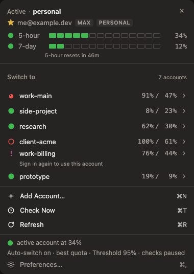
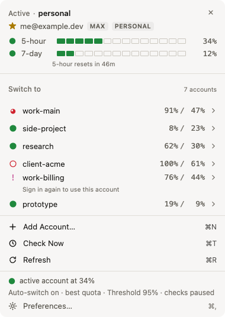
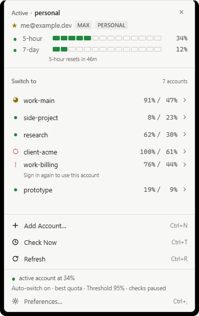
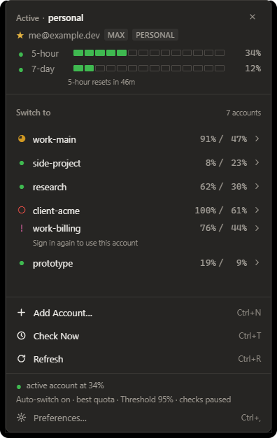

<div align="center">



# CCSwitcher

### All your Claude Code accounts, one keystroke apart.

A menu-bar app for macOS and a system-tray app for Windows. See where every
account stands, switch between them in one click, and let it rotate
automatically when one runs dry.

[](https://github.com/tomy1989/CCSwitcher-releases/releases/latest)

**[Download for Windows](https://github.com/tomy1989/CCSwitcher-releases/releases/latest) ·
[Download for macOS](https://github.com/tomy1989/CCSwitcher-releases/releases/latest)**

</div>

---

## The five-hour wall

You are deep in something. Claude Code stops: limit reached.

You own another account. Getting to it means quitting your session, hand-editing
`~/.claude/.credentials.json`, and hoping you have not just signed yourself out
of every MCP server you had authenticated. Ten minutes later, you have lost the
thread of what you were doing.

**CCSwitcher makes that two seconds.** Click the icon, click an account, carry on.

---

## What you get

|  |  |
|---|---|
| **Every account at a glance** | 5-hour and 7-day usage, per-model limits, and a countdown to each reset. The active account refreshes in the background; the others update when you hit Refresh, or automatically if you turn that on. |
| **One-click switching** | Swaps the signed-in account and leaves everything else in your Claude Code setup exactly as it was. |
| **Automatic rotation** | Opt in, and it moves you to a fresh account at a threshold you choose. Cooldown and hysteresis keep it from ping-ponging. |
| **Nothing in plaintext** | Tokens go in the macOS Keychain or Windows Credential Manager. Never a config file, never a log, never off your machine. |
| **Keyboard-driven** | Arrows to move, `Enter` to switch, `/` to search, `Esc` to dismiss. |
| **Updates itself** | Signed with its own key and verified before a byte is written to disk. |

<div align="center">




<sub>**macOS**</sub>




<sub>**Windows**</sub>

</div>

---

## Install

### Windows

Download **`CCSwitcher_x64-setup.exe`** and run it. Per-user, no administrator
rights.

SmartScreen will warn once — **More info → Run anyway**. The installer is
unsigned because certificates cost money and this is free; updates are
cryptographically verified regardless.

CCSwitcher lands in the notification area, bottom-right. Look under the `^`
overflow arrow the first time.

### macOS

Download **`CCSwitcher_universal.dmg`** — one file, Apple Silicon and Intel —
and drag it to **Applications**. It lives in the **menu bar, not the Dock**.

Keep it in `/Applications` rather than running it from the disk image: macOS
resolves the app through LaunchServices to deliver notifications, and that only
works from a real installed location.

Gatekeeper quarantines unsigned builds:

```bash
xattr -cr /Applications/CCSwitcher.app
```

> **Runs on hardware; not yet lived on.** It builds, installs, launches and
> sits in the menu bar correctly on Apple Silicon. What nobody has done yet is
> use it all day, every day — so treat the first week as a beta.

> **macOS will ask for Keychain access again after an update — your accounts
> are still there.** A Keychain grant is tied to the app's code signature, and
> without a paid Apple Developer ID every build is signed with a hash that
> changes each time, so macOS sees an update as a different app. Nothing is
> deleted; click **Always Allow** and it holds until the next update.

### Then

Click the icon → **Add Account…** → your browser opens Anthropic's own sign-in
page. Repeat per account. Whichever account you are already signed in to is
picked up automatically.

> **Restart your Claude Code session after switching.** The CLI reads its
> credentials once, at startup — so a session that was already open carries on
> with the old account until you restart it. This is the one thing people
> mistake for the switch not working.

---

## Is it safe?

It is holding your credentials, so the honest answer matters.

- **Tokens live in the OS vault** — macOS Keychain, Windows Credential Manager
  — in entries deliberately separate from Claude Code's own, so a bug here
  cannot damage the credential your CLI is using.
- **No log files at all.** Standard error only, everything through a redactor.
  Adversarial tests push realistically-shaped canary tokens through real
  operations and search every artefact produced for them.
- **No telemetry**, off by default, with no code path that sends a credential
  anywhere.
- **Updates are verified, not merely downloaded.** An Ed25519 signature checked
  against a public key compiled into the binary — whoever controls the network
  or this release page still cannot make it install anything.
- **Switching merges, never overwrites.** `.credentials.json` also holds
  `mcpOAuth` and `pluginSecrets`; replacing it wholesale would sign you out of
  every OAuth-authenticated MCP server. Every write is atomic, with read-back
  verification and rollback.

### Scope

CCSwitcher manages accounts **you already own or are authorised to use**. It
does not share accounts, pool credentials, or bypass any authentication or
rate-limiting control. It never sees your password — sign-in happens on
Anthropic's own page.

**Not affiliated with, endorsed by, or connected to Anthropic.**

---

## What it does not do

- No repository-to-account mapping yet.
- No UI for parallel isolated sessions.
- No team or shared-account features — deliberately, and never.
- No packaged Linux app.

---

## About this repository

This repo holds **compiled artifacts only**. There is no source here.

CCSwitcher's source lives in a private repository; releases are published
across to this public one so the auto-updater can fetch them without
credentials. Every release passes an automated gate first, which refuses to
publish if an artifact is not on an allowlist, contains anything
secret-shaped, embeds a build machine's home directory, or carries a signature
that does not verify.

Built with Rust and [Tauri 2](https://tauri.app). MIT licensed.
